<h2 align="center">Hi 👋, Stalo here.</h2>

<h5 align="center">
  <a href="https://jin-yuhan.github.io/">blog</a>
  &emsp;•&emsp;
  <a href="https://space.bilibili.com/456366858">bilibili</a>
</h5>

  
  &emsp;
  

<!--
**Jin-Yuhan/Jin-Yuhan** is a ✨ _special_ ✨ repository because its `README.md` (this file) appears on your GitHub profile.

Here are some ideas to get you started:

- 🔭 I’m currently working on ...
- 🌱 I’m currently learning ...
- 👯 I’m looking to collaborate on ...
- 🤔 I’m looking for help with ...
- 💬 Ask me about ...
- 📫 How to reach me: ...
- 😄 Pronouns: ...
- ⚡ Fun fact: ...
-->
